# 🔍 Manifest Verification System

## Purpose
Prevents **silent mis-indexing disasters** by validating vector dimensions and distance metrics before deployment.

## The Problem It Solves
Without verification, dimension drift can cause:
- ❌ **Silent indexing failures** (384-dim vectors → 1536-dim collection)
- ❌ **Semantic search breakage** (wrong distance metric)  
- ❌ **Expensive re-indexing** (discovering drift post-deployment)
- ❌ **Production outages** (index corruption)

## Files

### `manifest_verifier.py`
**Core verifier** - validates frozen config ↔ live Qdrant alignment

```bash
# Basic validation
python ops/verify/manifest_verifier.py \
  --config production_locked_config.yaml \
  --qdrant-url http://127.0.0.1:6333 \
  --collection context_store

# With manifest cross-check + text index requirement  
python ops/verify/manifest_verifier.py \
  --config production_locked_config.yaml \
  --manifest deployments/manifest-20250808-231251.json \
  --qdrant-url http://127.0.0.1:6333 \
  --collection context_store \
  --require-text-index
```

**Exit codes:**
- `0` = All validations passed
- `1` = Validation failed (blocks deployment)
- `2` = Missing dependencies (PyYAML)

### `ci-cd-gate.sh`
**CI/CD integration** - complete deployment gate with manifest verification

```bash
# Set environment variables
export QDRANT_URL="http://127.0.0.1:6333"
export VECTOR_COLLECTION="context_store"
export MANIFEST_FILE="deployments/manifest-20250808-231251.json"

# Run deployment gate
ops/verify/ci-cd-gate.sh
```

### `test_dimension_drift.py`
**Test suite** demonstrating drift detection scenarios

```bash
python ops/verify/test_dimension_drift.py
```

## Configuration Requirements

### Frozen Config Format (`production_locked_config.yaml`)
```yaml
embedding:
  model: all-MiniLM-L6-v2    # or model_name: all-MiniLM-L6-v2
  dimensions: 384            # or dim: 384
  
retrieval:
  distance: Cosine           # Cosine, Dot, Euclidean
```

### Manifest Format (`deployments/manifest-*.json`)
```json
{
  "storage_schema": {
    "qdrant": {
      "collection": "context_store",
      "vector_dim": 384,
      "distance": "Cosine"
    }
  }
}
```

## Supported Models
Built-in dimension mapping:
- `all-MiniLM-L6-v2`: 384
- `text-embedding-3-small`: 1536  
- `text-embedding-3-large`: 3072
- `text-embedding-ada-002`: 1536
- `bge-base-en-v1.5`: 768
- `bge-large-en-v1.5`: 1024
- `intfloat/e5-large-v2`: 1024

## Validation Flow

```mermaid
graph TD
    A[Load frozen config] --> B[Extract model + dimensions]
    B --> C[Load manifest optional]
    C --> D[Cross-check dimensions]
    D --> E[Query live Qdrant]
    E --> F[Compare all parameters]
    F --> G{All match?}
    G -->|Yes| H[✅ PASS - Deploy safe]
    G -->|No| I[❌ FAIL - Block deploy]
```



## Integration Examples

### GitHub Actions
```yaml
- name: Validate Deployment Manifest
  run: |
    python ops/verify/manifest_verifier.py \
      --config production_locked_config.yaml \
      --manifest deployments/manifest-${{ github.sha }}.json \
      --qdrant-url ${{ secrets.QDRANT_URL }} \
      --collection ${{ vars.VECTOR_COLLECTION }} \
      --require-text-index
```

### Docker Compose Healthcheck
```yaml
services:
  context-store:
    # ... other config
    healthcheck:
      test: ["CMD", "python", "ops/verify/manifest_verifier.py", "--require-text-index"]
      interval: 30s
      timeout: 10s
      retries: 3
```

### Cron Monitoring (Day-2 Ops)
```bash
# Every 6 hours - detect configuration drift
30 */6 * * * cd /srv/veris && python ops/verify/manifest_verifier.py --require-text-index || alert-oncall "Vector config drift detected"
```

## Error Scenarios & Fixes

### ❌ Dimension Mismatch
```
VERIFIER: ❌ Qdrant vector size 1536 != expected 384
```
**Fix:** Update frozen config or rebuild Qdrant collection with correct dimensions

### ❌ Distance Mismatch  
```
VERIFIER: ❌ Qdrant distance Dot != expected Cosine
```
**Fix:** Recreate collection with matching distance metric

### ❌ Missing Text Index
```
VERIFIER: ❌ Payload text index not present (require-text-index set)
```
**Fix:** Create text index: `PUT /collections/{collection}/index`

### ❌ Manifest Mismatch
```
VERIFIER: ❌ Manifest vector_dim (1536) != frozen config (384)
```  
**Fix:** Regenerate manifest with correct configuration

## Security Considerations
- ✅ **Read-only operations** (no mutations to Qdrant)
- ✅ **Fail-safe defaults** (blocks on any uncertainty)  
- ✅ **No secret handling** (only validates public schema)
- ✅ **CI/CD integration** (prevents bad deployments)

## Performance Notes
- **Fast execution:** < 1 second for typical collections
- **Minimal overhead:** Single HTTP request per validation
- **Cache-friendly:** No persistent connections or state

## Troubleshooting

### Connection Issues
```bash
# Test Qdrant connectivity
curl -f http://127.0.0.1:6333/collections

# Check collection exists
curl -f http://127.0.0.1:6333/collections/context_store
```

### Config Issues  
```bash
# Validate YAML syntax
python -c "import yaml; yaml.safe_load(open('production_locked_config.yaml'))"

# Check required fields
grep -E "(model|dimensions|distance)" production_locked_config.yaml
```

### Debug Mode
```bash
# Add verbose output (modify script to add debug prints)
python ops/verify/manifest_verifier.py --config production_locked_config.yaml 2>&1 | grep -E "(VERIFIER|ERROR)"
```

---

**🎯 This verification system prevents the exact 384↔1536 dimension mismatch that would have caused silent production failures. Deploy with confidence!**